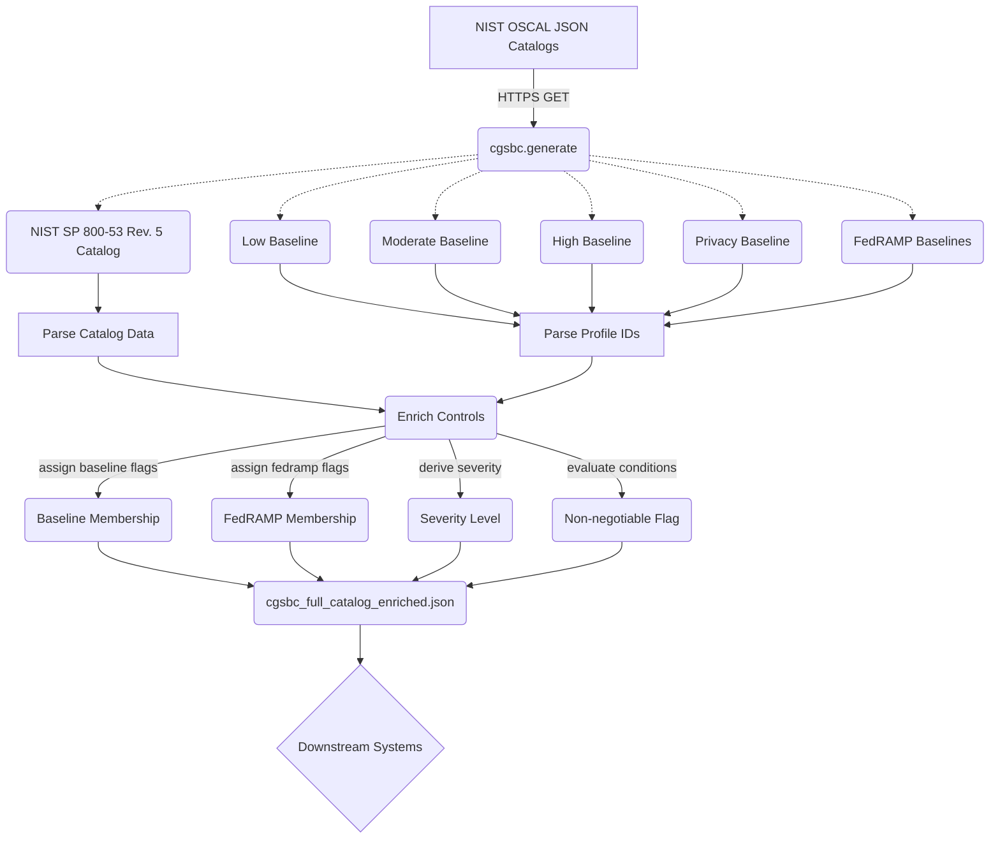

<div align="center">

# ControlGate Security Baseline Catalog (CGSBC)

<h3>Machine-Readable NIST SP 800-53 Rev. 5 + FedRAMP Enriched Catalog</h3>

<p>Daily-updated · Zero install · Cloud-agnostic</p>

[](https://github.com/sadayamuthu/controlgate-security-baseline-catalog/actions)
[](https://www.python.org/downloads/)
[](LICENSE)
[](https://openastra.org/cgsbc/catalog/v0.1/latest.json)
[](https://openastra.org/cgsbc/schema/v0.1/cgsbc.json)

---

[What is CGSBC?](#what-is-cgsbc) · [How It Works](#how-it-works) · [Distribution](#distribution) · [Quick Start](#quick-start) · [Features](#features) · [Development](#development)

</div>

---

## What is CGSBC?

**CGSBC** publishes a daily, machine-readable, cloud-agnostic security baseline derived from authoritative NIST publications — fetch it directly, no install required:

```
https://openastra.org/cgsbc/catalog/v0.1/latest.json
```

The catalog merges the full **NIST SP 800-53 Rev. 5** control catalog with **SP 800-53B** baseline profiles and **FedRAMP OSCAL** baselines, enriching every control with baseline membership flags, a derived severity level, and a non-negotiable indicator — all in one JSON file ready for policy engines, compliance dashboards, IaC scanners, or cloud-provider mapping tools.

It is also a runnable Python generator for teams who want to self-host or customise the pipeline.

---

## How It Works

```
NIST OSCAL Profiles  ──┐
SP 800-53 Catalog    ──┤
SP 800-53B Baselines ──┼──▶  cgsbc.generate  ──▶  Enriched Catalog JSON  ──▶  Downstream Systems
FedRAMP Baselines    ──┘
                           (severity · non_negotiable · baseline flags)
```

---

## Distribution

The catalog is published daily at a stable URL — no package to install.

| Artifact | URL | Updated |
|---|---|---|
| Latest catalog | `https://openastra.org/cgsbc/catalog/v0.1/latest.json` | daily |
| Historical catalog | `https://openastra.org/cgsbc/catalog/v0.1/historical/YYYY-MM-DD.json` | daily |
| JSON Schema | `https://openastra.org/cgsbc/schema/v0.1/cgsbc.json` | on schema change |
| YAML Schema | `https://openastra.org/cgsbc/schema/v0.1/cgsbc.yaml` | on schema change |

Schema version (`v0.1`) is bumped only when the catalog output structure changes, creating a new versioned URL path.

---

## Quick Start

Fetch the catalog directly:

```bash
curl -s https://openastra.org/cgsbc/catalog/v0.1/latest.json | jq '.count'
```

Or install the CLI and fetch directly:

```bash
pip install cgsbc
cgsbc fetch --out catalog.json
```

To run the generator locally (for self-hosting or development):

```bash
git clone https://github.com/sadayamuthu/controlgate-security-baseline-catalog.git
cd controlgate-security-baseline-catalog
python -m venv .venv && source .venv/bin/activate
pip install -e ".[dev]"
cgsbc generate --out baseline/cgsbc_full_catalog_enriched.json
```

---

## Features

- **Zero configuration** — downloads source OSCAL profiles directly from NIST and the GSA FedRAMP automation repo; no local data files to maintain.
- **Enriched output** — every control gets `severity` (LOW / MEDIUM / HIGH / CRITICAL) and `non_negotiable` (boolean) fields derived from configurable rules.
- **Baseline membership** — flags each control's presence in the NIST (Low, Moderate, High, Privacy) and FedRAMP (LI-SaaS, Low, Moderate, High) baselines.
- **Parent-enhancement linkage** — enhancement controls (e.g. `AC-2(1)`) are linked back to their parent (`AC-2`).
- **Configurable** — override any source URL or rule via CLI flags.
- **CI-ready** — ships with a GitHub Actions workflow that regenerates the baseline daily and commits the result.

---

## CLI Usage

```bash
# Download the pre-built catalog (fast, no OSCAL processing)
cgsbc fetch
cgsbc fetch --out my-catalog.json

# Generate the catalog from scratch
cgsbc generate
cgsbc generate --out my-catalog.json --non_negotiable_min_baseline high

# Print version
cgsbc --version
```

### `cgsbc fetch` options

| Flag | Default | Description |
|------|---------|-------------|
| `--out` | `cgsbc_full_catalog_enriched.json` | Output file path |

### `cgsbc generate` options

| Flag | Default | Description |
|------|---------|-------------|
| `--out` | `cgsbc_full_catalog_enriched.json` | Output file path |
| `--non_negotiable_min_baseline` | `moderate` | Minimum baseline for `non_negotiable=true` (`moderate` or `high`) |
| `--catalog_url` | NIST catalog URL | Override the NIST SP 800-53 catalog source |
| `--baseline_low_url` | NIST Low baseline URL | Override the Low baseline |
| `--baseline_moderate_url` | NIST Moderate baseline URL | Override the Moderate baseline |
| `--baseline_high_url` | NIST High baseline URL | Override the High baseline |
| `--baseline_privacy_url` | NIST Privacy baseline URL | Override the Privacy baseline |
| `--fedramp_lisaas_url` | FedRAMP LI-SaaS URL | Override the FedRAMP LI-SaaS baseline |
| `--fedramp_low_url` | FedRAMP Low URL | Override the FedRAMP Low baseline |
| `--fedramp_moderate_url` | FedRAMP Moderate URL | Override the FedRAMP Moderate baseline |
| `--fedramp_high_url` | FedRAMP High URL | Override the FedRAMP High baseline |
| `--version` | | Print version and exit |

---

## Output Schema

The generated JSON has this top-level structure:

```json
{
  "project": "ControlGate Security Baseline Catalog (CGSBC)",
  "project_version": "0.1.0",
  "generated_at_utc": "2026-02-18T06:00:00Z",
  "framework": "NIST SP 800-53 Rev. 5",
  "reference": { "publication": "...", "downloads": "..." },
  "rules": { "severity_definition": { ... }, "non_negotiable_min_baseline": "moderate" },
  "count": 1189,
  "controls": [ ... ]
}
```

Each item in `controls[]`:

| Field | Type | Example |
|-------|------|---------|
| `control_id` | string | `AC-2` or `AC-2(1)` |
| `control_name` | string | `Account Management` |
| `family` | string | `AC`, `AU`, `SC`, ... |
| `control_text` | string | Full control statement |
| `discussion` | string | Supplemental guidance |
| `related_controls` | string | Comma-separated IDs |
| `parent_control_id` | string or null | `AC-2` (for enhancements) |
| `baseline_membership` | object | `{ "low": true, "moderate": true, "high": true, "privacy": false }` |
| `fedramp_membership` | object | `{ "li_saas": false, "low": false, "moderate": true, "high": true }` |
| `severity` | string | `LOW` / `MEDIUM` / `HIGH` / `CRITICAL` |
| `non_negotiable` | boolean | `true` |

---

## Severity and Non-Negotiable Rules

**Severity** is assigned based on the *earliest* (least restrictive) baseline a control appears in:

| Condition | Severity |
|-----------|----------|
| In Low baseline | `MEDIUM` |
| In Moderate (not Low) | `HIGH` |
| In High (not Low or Moderate) | `CRITICAL` |
| Privacy-only | `MEDIUM` |
| Not in any baseline | `LOW` |

**Non-negotiable** defaults to `true` when a control is in the Moderate or High baseline. Pass `--non_negotiable_min_baseline high` to restrict it to High-only.

---

## Code Flow Design



---

## Project Structure

```
controlgate-security-baseline-catalog/
├── spec/
│   ├── VERSION              # schema version (semver → URL path)
│   └── schemas/
│       ├── cgsbc-v0.1.json   # JSON Schema for catalog output
│       └── cgsbc-v0.1.yaml   # YAML equivalent
├── src/cgsbc/
│   ├── __init__.py
│   ├── __main__.py
│   ├── cli.py
│   ├── fetch.py
│   ├── generate.py
│   └── urls.py
├── tests/
│   ├── test_cli.py
│   ├── test_fetch.py
│   ├── test_generate.py
│   ├── test_oscal_id.py
│   └── test_schema_validation.py
├── baseline/
│   └── historical/
├── .github/workflows/
│   ├── develop.yml
│   ├── main-release.yml
│   ├── pypi-publish.yml
│   └── schema-release.yml
├── pyproject.toml
├── Makefile
└── LICENSE
```

---

## Automation

Two workflows handle publishing:

**`main-release.yml`** — runs daily at 06:00 UTC (and on push to `main`, or manually):
1. Runs the test suite across Python 3.11, 3.12, and 3.13
2. Generates `baseline/cgsbc_full_catalog_enriched.json` and commits it to this repo
3. Pushes `latest.json` and a dated historical copy to `openastra.org/cgsbc/catalog/v0.1/`
4. Creates a GitHub Release (tag + changelog — the catalog URL is the artifact)

**`schema-release.yml`** — triggers only when `spec/**` changes:
1. Reads `spec/VERSION` (semver), validates it, checks the tag doesn't already exist
2. Pushes `cgsbc.json` and `cgsbc.yaml` to `openastra.org/cgsbc/schema/v0.1/`
3. Creates a GitHub Release tagged `spec-v{VERSION}` with schema files attached

**`pypi-publish.yml`** — triggers when a `v*.*.*` tag is pushed:
1. Builds the `cgsbc` Python package
2. Publishes to PyPI via OIDC Trusted Publishing (no API token required)

To bump the schema version, update `spec/VERSION` and add the new schema files to `spec/schemas/`.

---

## Development

```bash
make install-dev   # Install with dev dependencies
make test          # Run tests
make test-cov      # Run tests with 100% coverage enforcement
make format        # Auto-format code
make check         # Lint + tests with coverage
```

---

## Data Sources

All data is fetched live from official sources:

- [NIST SP 800-53 Rev. 5 OSCAL Content](https://github.com/usnistgov/oscal-content)
- [GSA FedRAMP Automation](https://github.com/GSA/fedramp-automation)

If NIST or GSA changes file names or paths, update `src/cgsbc/urls.py` or pass the correct URLs via CLI flags.

---

## License

MIT — for this repository's code. NIST content is public domain (U.S. Government work).

---

<div align="center">

**CGSBC is an open-source NIST SP 800-53 Rev. 5 + FedRAMP enriched catalog**

Managed by [OpenAstra](https://openastra.org).

[Catalog](https://openastra.org/cgsbc/catalog/v0.1/latest.json) · [GitHub](https://github.com/sadayamuthu/controlgate-security-baseline-catalog) · [Schema](https://openastra.org/cgsbc/schema/v0.1/cgsbc.json) · [OpenAstra](https://openastra.org)

</div>
